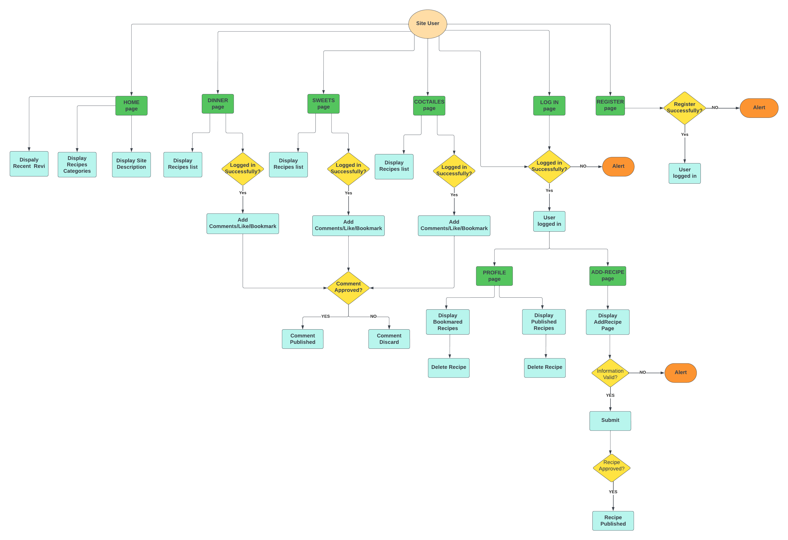
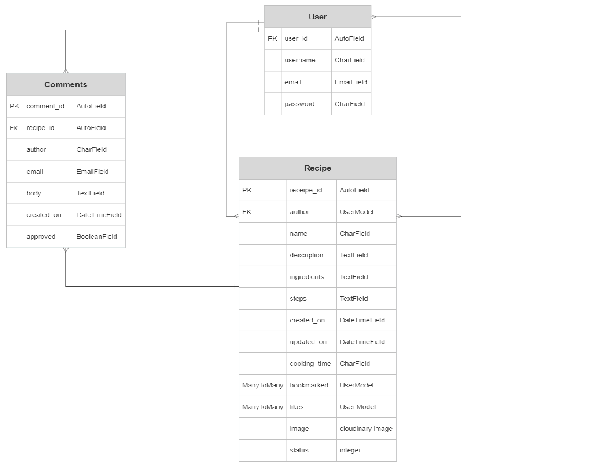

# Yummy - Cooking Recipes Website

Responsive image here

## CONTENTS

* [Introduction](#introduction)
* [User Experience UX](#user-experience-ux)
    * [User Stories](#user-stories)
    * [Design](#design)
        * [Colours](#colours)
        * [Fonts](#fonts)
        * [Wireframes](#wireframes)

* [Logic](#logic)
     * [Flowcharts](#flowcharts)
     * [Database Design](#database-design)

* [Game Features](#Game-Features)
    * [Introduction Message](#Introroduction-Message) 
    * [Ask Player Name](#Ask-Player-Name)
    * [Empty Input for Name](#Empty-Input-for-Name)
    * [Welcome Message](#Welcome-Message)
    * [Quiz Questions](#Quiz-Questions) 
    * [Correct Answer](#Correct-Answer)
    * [Incorrect Answer](#Incorrect-Answer)
    * [Invalid Data](#Invalid-Data)
    * [Final Score](#Final-Score)
    * [Play Again](#Play-Again)
* [Testing](#testing)
    * [PEP 8 Online](#PEP-8-Online)
    * [Lighthouse](#Lighthouse)
    * [Full Testing](#full-festing)
    * [Bugs](#Bugs)
* [Technologies Used](#technologies-used)
* [Deployment](#deployment)
    * [Forking this Project](#forking-this-project)
    * [Cloning this Project](#cloning-this-project)
* [Credits](#credits)
    * [Contents](#contents)
    * [Information Sources / Resources](#Information-Sources-Resources)
* [Acknowledgements](#Acknowledgements)

## Introduction

Yummy website is a website which designed and developed to offer free cooking recipes for different categories (dinner, sweets and coctailes). The website targets users who are interested in cooking and others who want to apply a specific recipe with clear and understandable steps. Users are givin the ability also to publish their own recipes, saving recipes on their own profile page as well as like and comments on others recipes. 

The fully deployed project can be accessed at [Here](https://portfolio-proj3.herokuapp.com/)

## User Experience - UX

### User Stories

|     EPIC               | User Story |
|     ---                |     ---    |
|  USER PROFILE          | As a Site User, I can register an account so that I can comment and like |
|                        | As a Site user I can see my status if I logged in or out so that I can interact with contents by leaving comments , like and bookmark recipes|
|                        | As a Site User, I can log in/ out so that I keep my account secure |
|                        | As a Logged-in User I can view my bookmarked recipes in my profile so that I can find them easily each time I need them
|                        | As a Site User, I can view my published recipes so that I can manage all my added recipes from my profile |
|  USER NAVIGATION       | As a Site User, I can navigate easily around site contents so that I know if it meets my neeeds |
|                        | As a Site User, I can view paginated list of reciepes so that I can easily select one to view |
|  RECIPE INTERACTION     | As a Site User, I can view a list of recipes so that I can select one to read |
|                         | As a Site User, I can click on a recipe post so that I can read full recipe details | 
|                         | As a Site User/Admin, I can view the number of likes on each post so that I can see which is the most popular |
|                          | As a Site User/Admin, I can view comments on an individual recipe so that I can read the conversation |
|                          | As a Site User, I can like or unlike recipe so that I can interact with the content|
|                          | As a Site User, I can leave comments on a recipe so that I can be involved in the conversation|
|                          | As a Site User, I can bookmark recipe so that I can save it in my profile|
|    RECIPE MANAGEMENT     | As a Site User, I can add my own recipe so that I can share it with other users|
|                          | As a Site Admin, I can create, read, update and delete recipes so that I can manage my site content and share recipes with other users|
|                          | As a Site User, I can sort my bookmarked recipes in my profile so that I can find the most favourite one easily|
|     SITE MANAGEMENT      | As a Site Admin I can approve or disapprove comments so that I can filter out objectionable comments|

[Back to top](<#contents>)

### Design

#### Colours
* The colours in the game are supplied by the Python Colorama Model

#### Fonts
* hgfuuuuuuuuuuuuuuuuuuuuuuuuuuuuuuuuuuuuuuuuuuuuuuuuu

#### Wireframes
* fxjdxjf

[Back to top](<#contents>)

## Logic

### Flowcharts 
This is the flowchart diagram for my website, represent how the system work step by step. The charts were generated using [Lucidchart](https://lucid.app/)  

 

### Database Design

 

[Back to top](<#contents>)

## Game Features

### Introduction Message

* When the users open the website, introduction message with quiz details are displayed here. 

[Back to top](<#contents>)

### Ask Player Name
* After the player sees the introduction message for a few seconds, the user will be asked to input his name. 

[Back to top](<#contents>)

#### Empty Input for Name
* If the player does not input their name and city, this alert will appear. 

[Back to top](<#contents>)

#### Welcome Message
 * After the player enters their desired username, a short welcome message is displayed and the user asked to press Enter key to start the quiz. 

[Back to top](<#contents>)

#### Quiz Questions

 * Then player is presented with the first quiz question.

 * Each question appear with 4 possible answers. Only one is correct.
 
 * The questions will be randomize every time the user choose to play again.
 
 * Instructions to enter a number between 1-4 is displayed. This allows the user to answer the quiz question via choosing one of these digits: '1', '2', '3', or '4'.

 * This will repeate until the 15th question is answered.

  

[Back to top](<#contents>)

#### Correct Answer

 * If the player answers the quiz question correctly, a simple message with: "Good! Your answer is correct :) ⭐" and more details about this question will be displayed.

 * The players score will increase by 1 at the same time a correct answer is guessed. 

 

[Back to top](<#contents>)

#### Incorrect Answer

 * If the player answers the quiz question incorrectly, a simple message with: "Your answer is incorrect :(. The correct answer is {correct_answer}."

 

[Back to top](<#contents>)

#### Invalid Data

 * If the player enter any data rather than '1','2','3' and '4', a message with: "Invalid data: please try again"

 

[Back to top](<#contents>)

#### Final Score
 * If the user finish the quiz, the final score out of 15 will be shown. And a "⭐⭐Congratulations!⭐⭐" message will be displyed if the total scores were equal or more than 13.

 

 

[Back to top](<#contents>)

#### Play Again

 * After the user answered all 15 questions and get the score, he will asked to play again by enter 'y' for yes or 'n' for no.

 * If the user enter anything rather than 'y' or 'n', this message will be displayed: "Invalid input: please enter 'y' to continue or 'n' to  exit.".

 

[Back to top](<#contents>)

* If the user enter 'y', The quiz questions will start again.

* If the user enter 'n', The quiz ends and a message with: "Thanks for you time:)" will be displayed.

 

[Back to top](<#contents>)

## Testing

### PEP 8 Online

The [PEP8](http://pep8online.com/) Validator Service was used to validate the Python file in the project to ensure there is no syntax errors in the project.

* No errors or warnings were found during the testing of the code in PEP8

 

[Back to top](<#contents>)

### Lighthouse 

* Lighthouse was used to test Performance, Best Practices, Accessibility and SEO on the Desktop.

 

[Back to top](<#contents>)

### Full Testing 

| Test     | Expected  Outcome   | Pass/Fail    | 
| :----     |    :----   |  :---- | 
| Run run.py | Loads run.py, username prompt appears | Pass |
| Insert username | Welcome message with entered username will displayed | Pass |
| Press Enter without insert name | Try again message will displayed | Pass |
| Press Enter to start | Prepering quiz messaege will appear, Page Clear function executes and the first question will displayed | Pass |
| Enter answer in digits (1-4) + Enter | Loads correct/incorrect Output and provides correct answer, loads next question | Pass |
| Press Enter With No Input/ Enter any other didgits | Invalid data message will be displayed, prompts user to try again and enter digits 1-4 | pass |
| Press Enter on Final Quiz question | Loads Final Score Output, Loads Game Over message and Try Again option | Pass |
| User gets score >= 13 | A congratulations message will displayed with the final score result score/15 | Pass |
| Press Enter or any enteries rather than 'y'/'n' | Loads Invalid Data message, prompts the user to try again and enter 'y' or 'n'. | Pass |
| Press Y on Try Again prompt |  Clears the page and runs quiz again, scores counter return back to 0 | Pass |
| Press N on Try Again Prompt | Loads Thankfull message to player, system exit command executed | Pass |

[Back to top](<#contents>)

## Bugs 
### Resolved

*Reverse for 'recipe_detail' with arguments '('',)' not found. 1 pattern(s) tried: ['(?P<slug>[-a-zA-Z0-9_]+)/\\Z']

[Back to top](<#contents>)

## Technologies Used

 * Python is the programming language used to produce this quiz game.
  
 * [GitHub](https://www.github.com) was used to hold the game repository files.

 * [Gitpod](https://www.gitpod.io) and [CodeAnywere](https://app.codeanywhere.com/) were used for the coding environment.

 * [Heroku](https://www.heroku.com) was used for deplyment.

## Deployment

* This site was deployed by completing the following steps:

1. Log in to [Heroku](https://id.heroku.com) or create an account
2. On the main page click the button labelled New in the top right corner and from the drop-down menu select Create New App
3. You must enter a unique app name
4. Next select your region
5. Click on the Create App button
6. The next page is the project’s Deploy Tab. Click on the Settings Tab and scroll down to Config Vars
7. Click Reveal Config Vars and enter POSRT into the Key box and 8000 into the Value box and click the Add button
8. If there are credentiels click Reveal Config Vars again and enter CREDS into the Key box and the Google credentials into the Value box
9. Next, scroll down to the Buildpack section click Add Buildpack select python and click Save Changes
10. Repeat step 8 to add node.js. o Note: The Buildpacks must be in the correct order. If not click and drag them to move into the correct order
11. Scroll to the top of the page and choose the Deploy tab
12. Select Github as the deployment method
13. Confirm you want to connect to GitHub
14. Search for the repository name and click the connect button
15. Scroll to the bottom of the deploy page and select the preferred deployment type
16. Click Enable Automatic Deploys for automatic deployment when you push updates to Github

## Forking This Project

* Fork this project by following the steps:

1. Open [GitHub](https://github.com/)
2. Click on the project to be forked
3. Find the Fork button at the top right of the page
4. Once you click the button the fork will be in your repository

## Cloning This Project

* Clone this project by following the steps:
  
1. Open [GitHub](https://github.com/)
2. Click on the project to be cloned
3. You will be provided with three options to choose from, HTTPS, SSH, or GitHub CLI, click the clipboard icon in order to copy the URL
4. Once you click the button the fork will be in your repository
5. Open a new terminal
6. Change the current working directory to the location that you want the cloned directory
7. Type git clone and paste the URL copied in step 3
8. Press Enter and the project is cloned

[Back to top](<#contents>)

## Credits

### Content

* All quiz questions have been taken from [Britannica](https://www.britannica.com/quiz/facts-you-should-know-the-periodic-table-quiz).

* Django CRUD template tutorial [Youtube] https://www.google.com/search?q=delete+recipe+sjango+app&rlz=1C1FKPE_svSE1020SE1020&oq=delete+recipe+sjango+app&aqs=chrome..69i57j33i10i160j33i10i22i29i30l2.14314j0j7&sourceid=chrome&ie=UTF-8#fpstate=ive&vld=cid:520893c7,vid:aStLddXMJrk

* The Python code functionality help is from the following: [Real Python Tutorials](https://realpython.com/python-quiz-application/#step-1-ask-questions) and from this repository [GitHub](https://github.com/KrystalCoding/plant-quiz/blob/main/README.md).

* Indentation warnings were solved by helping from [Flake8rules](https://www.flake8rules.com/).

* Readme file following templates from these repositories on GitHub : [plant-quiz](https://github.com/KrystalCoding/plant-quiz/blob/main/README.md) and [portfolio_project_3](https://github.com/PedroCristo/portfolio_project_3#Ask-Player-Name-and-City). 

### Information Sources / Resources

* [Code Institute](https://learn.codeinstitute.net/dashboard)
* [W3Schools - Python](https://www.w3schools.com/python/)
* [Stack Overflow](https://stackoverflow.com/)

[Back to top](<#contents>)

## Acknowledgements
This App was completed as a Portfolio Project 3 for the Full Stack Software Developer Diploma at the [Code Institute](https://codeinstitute.net/). I would like to thank my mentor [Precious Ijege](https://www.linkedin.com/in/precious-ijege-908a00168/), the Slack community, tutor support. And all at the Code Institute for their help.

[Back to top](<#contents>)