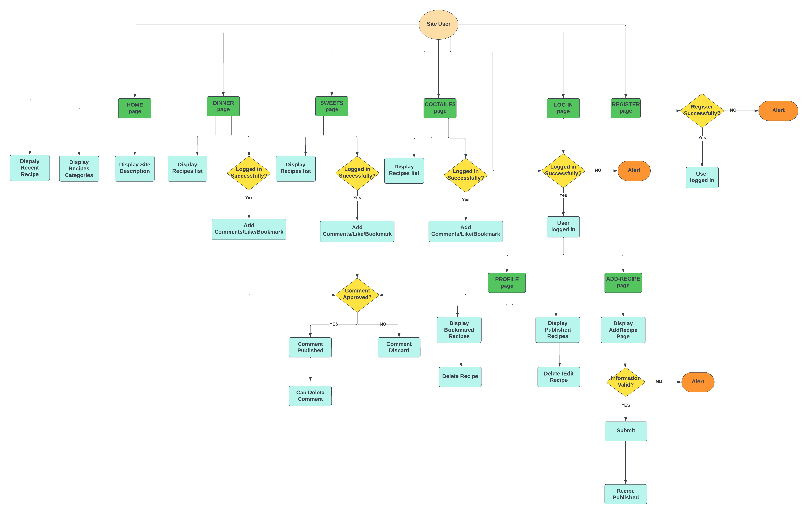

# Yummy - Cooking Recipes Website

Responsive image here

## CONTENTS

* [Introduction](#introduction)
* [User Experience UX](#user-experience-ux)
    * [User Stories](#user-stories)
    * [Design](#design)
        * [Colours](#colours)
        * [Fonts](#fonts)
        * [Wireframes](#wireframes)

* [Logic](#logic)
     * [Flowcharts](#flowcharts)
     * [Database Design](#database-design)
* [Agile Methodology](#agile-methodology)
* [Game Features](#Game-Features)
    * [Introduction Message](#Introroduction-Message) 
    * [Ask Player Name](#Ask-Player-Name)
    * [Empty Input for Name](#Empty-Input-for-Name)
    * [Welcome Message](#Welcome-Message)
    * [Quiz Questions](#Quiz-Questions) 
    * [Correct Answer](#Correct-Answer)
    * [Incorrect Answer](#Incorrect-Answer)
    * [Invalid Data](#Invalid-Data)
    * [Final Score](#Final-Score)
    * [Play Again](#Play-Again)
* [Testing](#testing)
    * [PEP 8 Online](#PEP-8-Online)
    * [Lighthouse](#Lighthouse)
    * [Full Testing](#full-festing)
    * [Bugs](#Bugs)
* [Technologies Used](#technologies-used)
* [Deployment](#deployment)
    * [Forking this Project](#forking-this-project)
    * [Cloning this Project](#cloning-this-project)
* [Credits](#credits)
    * [Contents](#contents)
    * [Information Sources / Resources](#Information-Sources-Resources)
* [Acknowledgements](#Acknowledgements)

## Introduction

Yummy website is a website which designed and developed to offer free cooking recipes for different categories (dinner, sweets and coctailes). The website targets users who are interested in cooking and others who want to apply a specific recipe with clear and understandable steps. Users are givin the ability also to publish their own recipes, saving recipes on their own profile page as well as like and comments on others recipes. 

The fully deployed project can be accessed at [Here](https://portfolio-proj3.herokuapp.com/)

## User Experience - UX

### User Stories

|     EPIC               | User Story |
|     ---                |     ---    |
|  USER PROFILE          | As a Site User, I can register an account so that I can comment and like |
|                        | As a Site user I can see my status if I logged in or out so that I can interact with contents by leaving comments , like and bookmark recipes|
|                        | As a Site User, I can log in/ out so that I keep my account secure |
|                        | As a Logged-in User I can view my bookmarked recipes in my profile so that I can find them easily each time I need them
|                        | As a Site User, I can view my published recipes so that I can manage all my added recipes from my profile |
|  USER NAVIGATION       | As a Site User, I can navigate easily around site contents so that I know if it meets my needs |
|                        | As a Site User, I can view paginated list of reciepes so that I can easily select one to view |
|                        | As a Site user, I can see navigation path of the page so that I know where I am and navigate easy  |
|  RECIPE INTERACTION     | As a Site User, I can view a list of recipes so that I can select one to read |
|                         | As a Site User, I can click on a recipe post so that I can read full recipe details | 
|                         | As a Site User/Admin, I can view the number of likes on each recipe so that I can see which is the most popular |
|                          | As a Site User/Admin, I can view comments on an individual recipe so that I can read the conversation |
|                          | As a Logged-in User, I can like or unlike recipe so that I can interact with the content|
|                          | As a Logged-in User, I can leave comments on a recipe so that I can be involved in the conversation|
|                          | As a Logged-in User, I can bookmark recipe so that I can save it in my profile|
|    RECIPE MANAGEMENT     | As a Logged-in User, I can add my own recipe so that I can share it with other users|
|                          | As a Site Admin, I can create, read, update and delete recipes so that I can manage my site content and share recipes with other users|
|                          | As a Site User, I can sort my bookmarked recipes in my profile so that I can find the most favourite one easily|
|     SITE MANAGEMENT      | As a Site Admin I can approve or disapprove comments so that I can filter out objectionable comments|

[Back to top](<#contents>)

### Design

#### Colours
* The colour scheme was used based on blue colour for main background and header (logo and nav links) and light yellow for body text. It is a great light shade and suitable for the text in which for creating a good contrast. 

#### Fonts
* The fonts I used for the site were imported from [Google Fonts](https://fonts.google.com/): 
**Body:** *Alegreya, cursive, serif* 
**Navbar:** *Alegreya, cursive, sans-serif* 
**Logo:** *Pacifico, cursive, sans-serif* 

#### Wireframes
* The wireframes for desktop and mobile were created with [Balsamiq](https://balsamiq.com/) 

Home Page

Dinner Recipes

Sweets Recipes

Coctailes Recipes

Register

Log In 

Add Recipe 

My Bookmarks 

My Recipes 

[Back to top](<#contents>)

## Logic

### Flowcharts 
This is the flowchart diagram for my website, represent how the system work step by step. The charts were generated using [Lucidchart](https://lucid.app/)  

 

### Database Design

 

[Back to top](<#contents>)

## Agile Methodology
The project was developed using the Agile methodology. Product backlog is detailed into three levels: 
* Epics which is a large quantities of related work, which were five epics for the project. Each of them has a list of features.
* A feature, is a service that delivers value to the end user. 
* Each feature is broken down into a number simpler tasks which are user stories. 

As the user stories were achieved, they were moved from To Do list, to In-Progress, and finally Done lists. You can have a look to the project board [here](https://github.com/users/AlaYousef/projects/4/views/1?layout=board)

Sprints Details

* **Sprint 1 - SETTING-UP** 
    -Setup Django 
    -Deploy on heroku  
* **Sprint 2 - SITE MANAGEMENT** 
    -Building The Admin Site  
* **Sprint 3 - NAVIGATION** 
    -Create a navigation menu 
    -Add website logo, nav menue 
    -Choose fonts, colors and background images   
* **Sprint 4 - RECIPE INTERACTION** 
    -Create recipe, comment models 
    -Create Recipes list view and recipe detail view. 
    -Return to Sprint 3, Implement pagenation.  
* **Sprint 5 - USER PROFILE** 
    -Implement *Register*, *Login* and *Logout* pages with forms using the django-allauth module. 
    -Return to Sprint 4, Implement *Like*, *bookmark* and *comment* features. 
    -Implement form for adding and updating recipes 
    -Create *bookmarked* and *my recipes* pages. 
    -Return to Sprint 4, Implement *delete* comment feature.  

  

credits: https://www.knowledgehut.com/blog/agile/features-in-agile-methodology#what%E2%80%99s-the-difference-between-features-and-epics-in-agile?

[Back to top](<#contents>)

## Features
### Home Page
* Home page contain a welcome message for logged-in users with short description about the website will appear. 
* Three recipes cards with three different categories will displayed. When the user click on one of it , will navigate to recipe list of the specific category.
* Recent recipes will appear also at the end of the home page. On click the user clicked will navigate to the specific recipe details page.
* Top arrow, an arrow appears at the end of the page to return back to the top of the home page for ease of navigation for users. 

 

#### Header

* Logo with site name positioned in the top left of the header section. This logo is linked to the home page to facilitate navigation for users.  
* The navigation bar displayed at the right top of header section includes all links to the various other pages.
* When the user logged in, profile and add-recipe links added to the navigation bar. In addnition to log-out instead of log-in/register.
* The navigation bar is fully responsive, collapsing into a hamburger on small screen sizes. 

  

#### Footer

* The footer section includes links to social media, Facebook, Twitter, Instagram and Youtube.
* Each of these links opens a separate tab on clicking to keep accessibility and stay consistent, so users know what to expect when they are navigating through the website.

 

[Back to top](<#contents>)

### Account Section
* Registration, log in and log out are implemented using Django allauth library.

#### Register Page
* To register an account, users required to enter uersname, email, password and password confirmation.
* After all information entered correctly the user will redirect to the Home page with a confirmation message "Successfully signed in as (user name)".

 

  

#### Log-in Page
* Users is required to enter username and password to log in.
* After the user enter the required information, the user will redirect to the home page with a confirmation message "Successfully signed in as (user name)".
* Since the user register
 

* Log in confirmation message.
  

#### Log-out Page
* The user asked "Are you sure you want to log out?".
* User will redirect to the _Home_ page if the user click _yes_.

  

* Log out confirmation message.
 

### Dinner, Sweets, Coctailes Pages
 * Each of these tabs are linked to a page with list of recipes which only contain recipes within the specific category. 
 * Each of these pages has a pagination to divide the content into separate pages. The page contain 6 recipes cards and the rest are appears in the next page. So users can navigate to them using next button and return back using previous button.

  

### Recipe Details Page
#### Recipe information 

* If the user click on any recipe name for different categories, the user will navigate to the recipe detail page.
* This page conatin all information that the user need for the recipe. Including recipe name, author, cooking/preparing time, Ingredients and steps to apply this recipe.
* Logged-in users can save this recipe in his own profile by bookmark this recipe throw this icon 
 .
* In addition, users can like or dislike the recipe throw the icon  next to the number of likes for this recipe.  

   

#### Comments Section 
* The website is interactive so logged-in users can leave comments on a specific recipe.
* These comments must be approved by the site admin befor publishing.
* Logged-in user can delete his own comment if needed by clicking on this icon  beside the author name.  

 

* If this Icon clicked, the user will be asked _Are you sure you want to delete this comment?_. If _Yes_ is clicked the comment will deleted and the user will stay in recipe details page. 

  

[Back to top](<#contents>)

### Add Recipe Page

   

* Add Recipe confirmation message
   
 
[Back to top](<#contents>)

### Profile Dropdown Menu
  

#### My Bookmarkes page
   
 
* Bookmark recipe confirmation message
  

#### My Recipes page
  

[Back to top](<#contents>)

## Testing

### PEP 8 Online

The [PEP8](http://pep8online.com/) Validator Service was used to validate the Python file in the project to ensure there is no syntax errors in the project.

* No errors or warnings were found during the testing of the code in PEP8

 

[Back to top](<#contents>)

### Lighthouse 

* Lighthouse was used to test Performance, Best Practices, Accessibility and SEO on the Desktop.

 

[Back to top](<#contents>)

### Full Testing 

| Test     | Expected  Outcome   | Pass/Fail    | 
| :----     |    :----   |  :---- | 
| Run run.py | Loads run.py, username prompt appears | Pass |
| Insert username | Welcome message with entered username will displayed | Pass |
| Press Enter without insert name | Try again message will displayed | Pass |
| Press Enter to start | Prepering quiz messaege will appear, Page Clear function executes and the first question will displayed | Pass |
| Enter answer in digits (1-4) + Enter | Loads correct/incorrect Output and provides correct answer, loads next question | Pass |
| Press Enter With No Input/ Enter any other didgits | Invalid data message will be displayed, prompts user to try again and enter digits 1-4 | pass |
| Press Enter on Final Quiz question | Loads Final Score Output, Loads Game Over message and Try Again option | Pass |
| User gets score >= 13 | A congratulations message will displayed with the final score result score/15 | Pass |
| Press Enter or any enteries rather than 'y'/'n' | Loads Invalid Data message, prompts the user to try again and enter 'y' or 'n'. | Pass |
| Press Y on Try Again prompt |  Clears the page and runs quiz again, scores counter return back to 0 | Pass |
| Press N on Try Again Prompt | Loads Thankfull message to player, system exit command executed | Pass |

[Back to top](<#contents>)

## Bugs 
### Resolved

*Reverse for 'recipe_detail' with arguments '('',)' not found. 1 pattern(s) tried: ['(?P<slug>[-a-zA-Z0-9_]+)/\\Z']
absolut url....

[Back to top](<#contents>)

## Technologies Used

 * Python is the programming language used to produce this quiz game.
  
 * [GitHub](https://www.github.com) was used to hold the game repository files.

 * [Gitpod](https://www.gitpod.io) and [CodeAnywere](https://app.codeanywhere.com/) were used for the coding environment.

 * [Heroku](https://www.heroku.com) was used for deplyment.

## Deployment

* This site was deployed by completing the following steps:

1. Log in to [Heroku](https://id.heroku.com) or create an account
2. On the main page click the button labelled New in the top right corner and from the drop-down menu select Create New App
3. You must enter a unique app name
4. Next select your region
5. Click on the Create App button
6. The next page is the project’s Deploy Tab. Click on the Settings Tab and scroll down to Config Vars
7. Click Reveal Config Vars and enter POSRT into the Key box and 8000 into the Value box and click the Add button
8. If there are credentiels click Reveal Config Vars again and enter CREDS into the Key box and the Google credentials into the Value box
9. Next, scroll down to the Buildpack section click Add Buildpack select python and click Save Changes
10. Repeat step 8 to add node.js. o Note: The Buildpacks must be in the correct order. If not click and drag them to move into the correct order
11. Scroll to the top of the page and choose the Deploy tab
12. Select Github as the deployment method
13. Confirm you want to connect to GitHub
14. Search for the repository name and click the connect button
15. Scroll to the bottom of the deploy page and select the preferred deployment type
16. Click Enable Automatic Deploys for automatic deployment when you push updates to Github

## Forking This Project

* Fork this project by following the steps:

1. Open [GitHub](https://github.com/)
2. Click on the project to be forked
3. Find the Fork button at the top right of the page
4. Once you click the button the fork will be in your repository

## Cloning This Project

* Clone this project by following the steps:
  
1. Open [GitHub](https://github.com/)
2. Click on the project to be cloned
3. You will be provided with three options to choose from, HTTPS, SSH, or GitHub CLI, click the clipboard icon in order to copy the URL
4. Once you click the button the fork will be in your repository
5. Open a new terminal
6. Change the current working directory to the location that you want the cloned directory
7. Type git clone and paste the URL copied in step 3
8. Press Enter and the project is cloned

[Back to top](<#contents>)

## Credits

### Content

* All quiz questions have been taken from [Britannica](https://www.britannica.com/quiz/facts-you-should-know-the-periodic-table-quiz).

* Django CRUD template tutorial [Youtube] https://www.google.com/search?q=delete+recipe+sjango+app&rlz=1C1FKPE_svSE1020SE1020&oq=delete+recipe+sjango+app&aqs=chrome..69i57j33i10i160j33i10i22i29i30l2.14314j0j7&sourceid=chrome&ie=UTF-8#fpstate=ive&vld=cid:520893c7,vid:aStLddXMJrk

* redirect after deleting https://stackoverflow.com/questions/31275574/
    reverse-for-success-url-on-django-class-based-view-complain-about-circular-impor

* The Python code functionality help is from the following: [Real Python Tutorials](https://realpython.com/python-quiz-application/#step-1-ask-questions) and from this repository [GitHub](https://github.com/KrystalCoding/plant-quiz/blob/main/README.md).

* Indentation warnings were solved by helping from [Flake8rules](https://www.flake8rules.com/).

* Readme file following templates from these repositories on GitHub : [plant-quiz](https://github.com/KrystalCoding/plant-quiz/blob/main/README.md) and [portfolio_project_3](https://github.com/PedroCristo/portfolio_project_3#Ask-Player-Name-and-City). 

### Information Sources / Resources

* [Code Institute](https://learn.codeinstitute.net/dashboard)
* [W3Schools - Python](https://www.w3schools.com/python/)
* [Stack Overflow](https://stackoverflow.com/)

[Back to top](<#contents>)

## Acknowledgements
This App was completed as a Portfolio Project 3 for the Full Stack Software Developer Diploma at the [Code Institute](https://codeinstitute.net/). I would like to thank my mentor [Precious Ijege](https://www.linkedin.com/in/precious-ijege-908a00168/), the Slack community, tutor support. And all at the Code Institute for their help.

[Back to top](<#contents>)
