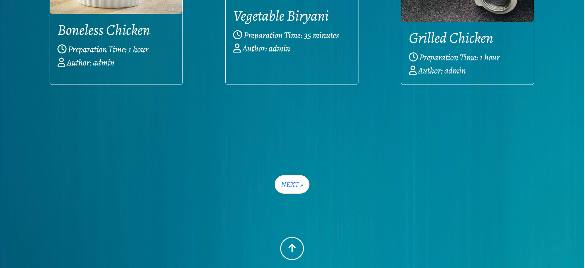
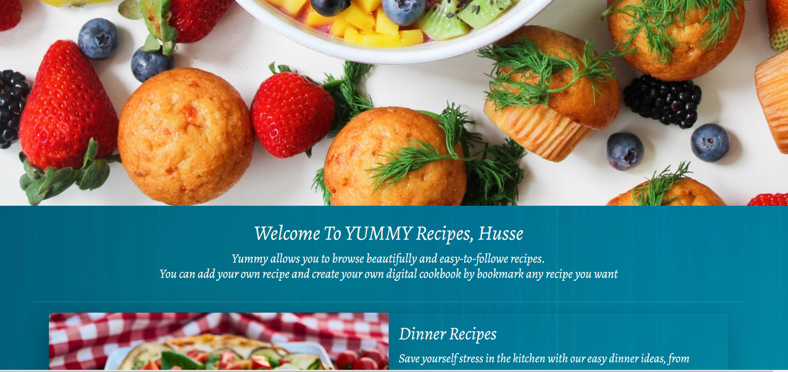
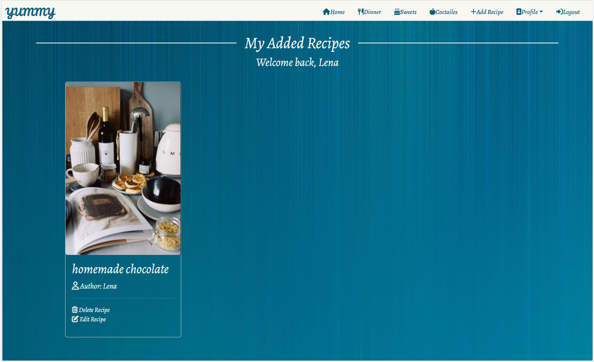

# Testing

Back to [README.md](README.md) 

## Table of contents
* [User Story and Feature Testing](#user-story-and-feature-testing)
* [Browser Testing](#browser-testing)
* [Code Validation](#code-validation)
* [Bugs](#bugs)

## User Story and Feature Testing
### EPIC | User Navigation
#### Content Navigation
 _As a Site User I can navigate easily around site contents so that I know if it meets my neeeds._

- Navigation bar is visible on every page of the website and fully responsive on different screen sizes.

 
- Arrow at the end of each page help users to navigate easily to the top especially in the home page.

  

#### Site Pagenation
* _As a Site User I can view paginated list of reciepes so that easily select one to view._

- On clicking on any recipe category will display a list of recipes. Each page has 6 recipe and the other recipes displayed on the next page that can be displayed on clicking on the next button. 

  

### EPIC | User Profile
#### Account Registration
 _As a Site User I can register an account so that I can comment and like._

- Navigation bar is visible on every page of the website and fully responsive on different screen sizes.

 
- Arrow at the end of each page help users to navigate easily to the top especially in the home page.

  

#### Account Registration
 _As a Site User I can register an account so that I can comment and like._

* Users can see _Register_ link in the navbr, when clicked user will be navigate to sign-up page to fill the required information.

#### Log in / out
 _As a Site User I can log in/ out so that I keep my account secure._

* After the user register an account, _log-in_ and _log-out_ links can be accessed.

#### Log in Status
 _As a Site user I can see my status if I logged in or out so that I can interact with contents by leaving comments , like and bookmark recipes._

* Once the user logged in, the user name will be diplayed in the home page, my bookmarke and my recipes pages. 

 

* Also the user will see Add recipe and profile dropdown links after logged-in.
* The user can see comment form, so can leave a comment.
* The user can like/dislike and bookmarke recipes.
* If the user click on like or bookmarke buttons without logging-in, the user will be rdeirect to log-in page to log-in.

#### View Bookmarked recipes
 _As a Logged-in User I can view my bookmarked recipes in my profile so that I can find them easily each time I need them._

* Logged-in users can access profile dropdown menu. So the user can open bookmark page and view all bookmarked recipes.

#### View My Published Recipes
 _As a Site User I can view my published recipes so that I can manage all my added recipes from my profile._

 * Logged-in can access my recipes page and view all his own published recipes.

### EPIC | Recipe Mangagement
#### Mange User Recipe
 _As a Site User I can add my own recipe so that I can share it with other users._

* Logged-in users can add their own recipes and have access to them by editing or deleting.
* The user will get confirmation message to notified that the recipe has been created,updated or deleted successfully. 

 

####  Admin Managment.
 _As a Site Admin I can create, read, update and delete recipes so that I can manage my site content and share recipes with other users._

* Site admin has the access all CRUD features from the backend.

### EPIC | Recipe Interaction
#### View Recipeslist
 _As a Site User I can view a list of recipes so that I can select one to read._

* All users can view recipes lists for any category on any time.

#### View Recipe
 _As a Site User I can click on a recipe post so that I can read full recipe details._

* All users can show all the detailes of any recipe separately.

#### View Comments
 _As a Site User/Admin I can view comments on an individual recipe so that I can read the conversation._

* All users can read the comment on each recipe. So, csn get an impression of the recipe before applying it.

#### Comment on a recipe
 _As a Site User I can leave comments on a recipe so that I can be involved in the conversation._

* Looged in users can leave a comment on a specific recipe, so he can write his review or experience for this recipe.

#### View Likes
 _As a Site User/Admin I can view the number of likes on each post so that I can see which is the most popular._

* All users can see the how many likes on each recipe. Therfore, he can easily find out the most delicious recipe and try it.

#### Like / Unlike Recipe
 _As a Site User I can like or unlike recipe so that I can interact with the content._

* Logged in users can like/dislike a specific recipe.

#### Add bookmark
 _As a Site User I can bookmark recipe so that I can save it in my profile._

* Logged in users can save any recipe they liked inthe bookmark page so can return to in needed.

### EPIC | Site Management
#### Approve Comments
 _As a Site Admin I can approve or disapprove comments so that I can filter out objectionable comments._

* All the published comment were approved only by the site admin.

## Browser Testing
The website was tested on different browsers for assuring the features work accordingly.
* Chrome
* Edge
* Firefox
* Opera

* On Firefox when hovering on the recipe name, name should be underline but on firefox the name display with double underlines.

## Code Validation
### HTML
### CSS
### Javascript
### Python
## Bugs 

Back to [README.MD](README.MD) 
 