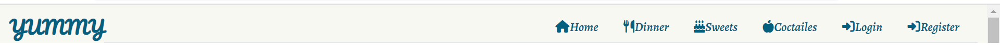

# Testing

Back to [README.md](README.md) 

## Table of contents
* [User Story and Feature Testing](#user-story-and-feature-testing)
* [Browser Testing](#browser-testing)
* [Code Validation](#code-validation)
* [Bugs](#bugs)

## User Story and Feature Testing
### EPIC | User Navigation
#### Content Navigation
 _As a Site User I can navigate easily around site contents so that I know if it meets my neeeds._

- Navigation bar is visible on every page of the website and fully responsive on different screen sizes.

 
- Arrow at the end of each page help users to navigate easily to the top especially in the home page.

  

#### Site Pagenation
* _As a Site User I can view paginated list of reciepes so that easily select one to view._

- On clicking on any recipe category will display a list of recipes. Each page has 6 recipe and the other recipes displayed on the next page that can be displayed on clicking on the next button. 

  

### EPIC | User Profile
#### Account Registration
 _As a Site User I can register an account so that I can comment and like._

- Navigation bar is visible on every page of the website and fully responsive on different screen sizes.

 
- Arrow at the end of each page help users to navigate easily to the top especially in the home page.

  

#### Account Registration
 _As a Site User I can register an account so that I can comment and like._

* Users can see _Register_ link in the navbr, when clicked user will be navigate to sign-up page to fill the required information.

#### Log in / out
 _As a Site User I can log in/ out so that I keep my account secure._

* After the user register an account, _log-in_ and _log-out_ links can be accessed.

#### Log in Status
 _As a Site user I can see my status if I logged in or out so that I can interact with contents by leaving comments , like and bookmark recipes._

* Once the user logged in, the user name will be diplayed in the home page, my bookmarke and my recipes pages. 

 

* Also the user will see Add recipe and profile dropdown links after logged-in.
* The user can see comment form, so can leave a comment.
* The user can like/dislike and bookmarke recipes.
* If the user click on like or bookmarke buttons without logging-in, the user will be rdeirect to log-in page to log-in.

#### View Bookmarked recipes
 _As a Logged-in User I can view my bookmarked recipes in my profile so that I can find them easily each time I need them._

* Logged-in users can access profile dropdown menu. So the user can open bookmark page and view all bookmarked recipes.

#### View My Published Recipes
 _As a Site User I can view my published recipes so that I can manage all my added recipes from my profile._

 * Logged-in can access my recipes page and view all his own published recipes.

### EPIC | Recipe Mangagement
#### Mange User Recipe
 _As a Site User I can add my own recipe so that I can share it with other users._

* Logged-in users can add their own recipes and have access to them by editing or deleting.
* The user will get confirmation message to notified that the recipe has been created,updated or deleted successfully. 

 

####  Admin Managment.
 _As a Site Admin I can create, read, update and delete recipes so that I can manage my site content and share recipes with other users._

* Site admin has the access all CRUD features from the backend.

### EPIC | Recipe Interaction
#### View Recipeslist
 _As a Site User I can view a list of recipes so that I can select one to read._

* All users can view recipes lists for any category on any time.

#### View Recipe
 _As a Site User I can click on a recipe post so that I can read full recipe details._

* All users can show all the detailes of any recipe separately.

#### View Comments
 _As a Site User/Admin I can view comments on an individual recipe so that I can read the conversation._

* All users can read the comment on each recipe. So, csn get an impression of the recipe before applying it.

#### Comment on a recipe
 _As a Site User I can leave comments on a recipe so that I can be involved in the conversation._

* Looged in users can leave a comment on a specific recipe, so he can write his review or experience for this recipe.

#### View Likes
 _As a Site User/Admin I can view the number of likes on each post so that I can see which is the most popular._

* All users can see the how many likes on each recipe. Therfore, he can easily find out the most delicious recipe and try it.

#### Like / Unlike Recipe
 _As a Site User I can like or unlike recipe so that I can interact with the content._

* Logged in users can like/dislike a specific recipe.

#### Add bookmark
 _As a Site User I can bookmark recipe so that I can save it in my profile._

* Logged in users can save any recipe they liked inthe bookmark page so can return to in needed.

### EPIC | Site Management
#### Approve Comments
 _As a Site Admin I can approve or disapprove comments so that I can filter out objectionable comments._

* All the published comment were approved only by the site admin.

## Browser Testing
The website was tested on different browsers for assuring the features work accordingly.
* Chrome
* Edge
* Firefox
* Opera

* On Firefox when hovering on the recipe name, name should be underline but on firefox the name display with double underlines.
### LightHouse 
PAD Performance....
 

## Code Validation
### HTML
The html code of the website was validated using [W3 Markup Validator](https://validator.w3.org/). 
The validation have the following outcome:  

  

The pages that have been tested:
* Base
* Home
* Dinner
* Sweets
* Coctailes
* Add Recipe
* My Bookmarkes
* My Recipes
* Login/Log out/Register
* Recipe Detail
* Delete Recipe
* Edit Recipe
* Delete Comment

### CSS
The CSS code was validated using [W3 Jigsaw Validator](https://jigsaw.w3.org/css-validator/) with no errors. 

  

### Javascript
The Javascript code was validated using using [JsHint](https://jshint.com/) 
I have validate two functions as the following:

  

In the begening I get these warning the following warnings, and fixed using change datatype from let to var to be available througt the function.
  

### Python
The [PEP8](http://pep8online.com/) Validator Service was used to validate the following Python files in the project to ensure there is no syntax errors in the project.

  

## Device Testing
- The website was viewed on a variety of devices such as Desktop, Laptop, iPhone SE, iPhoneXR, iPhone 12 Pro iPad, and iPad Air to ensure responsiveness on different screen sizes.

## Responsiveness Test

### Site Navigation
| Test               | Action     | Expected Outcome                                                    | Pass/Fail |
|-----------------------|------------|--------------------------------------------------------------------|-----------|
| **NavBar**              |            |                                                                    |           |
| Site Name (logo) | Click      | Redirect to home page                                                | Pass      |
| Home Link             | Click      | Redirect to home page                                                | Pass      |
| Dinner Link   | Click      | Open Dinner Recipes Page                                           | Pass      |
| Sweets Link   | Click      | Open Sweets Recipes Page                                           | Pass      |
| Coctailes Link   | Click      | Open Coctailes Recipes Page                                           | Pass      |
| Add Recipe Link       | Click      | Open Add Recipe Form Page                                             | Pass      |
| Add Recipe Link       | Unvisible    | Only Visible if User is Authenticated                                    | Pass      |
| Profile Dropdown Menu     | Click      | Open profile dropdown menu (My Bookmarks, My Recipes)                                            | Pass      |
| Profile Dropdown Menu | Unvisible      | Only Visible if User is Authenticated                                            | Pass      |
| My Bookmarks Link       | Click      | Open My Bookmarks page                                               | Pass      |
| My Recipes Link       | Click    | Open My Added Recipes page                                   | Pass      |
| Log In Link           | Click      | Open Login Form Page                                                    | Pass      |
| Log In Link           | Unvisible    | Unvisible if user is Authenticated                                     | Pass      |
| Register Link          | Click      | Open Sign up Form page                                                  | Pass      |
| Register Link          | Unvisible    | Unvisible if user is Authenticated                                     | Pass      |
| Logout Link           | Click      | Display logout confirmation message                                            | Pass      |
| Logout Link           | Unvisible    | Only visible if user is logging in                                    | Pass      |
| Nav Links         | Hover      | Resize text (larger), Borderd                                                     | Pass      
| **Mobile View**           |            |                                                                    |           |
| Hamburger Icon        | Responsive | Display when screen size width is less than 1000px                     | Pass      |
| Hamburger Icon        | Click | Display Offcanvas with navs menu                    | Pass      |
| Site Name (logo) | Click      | Redirect to home page                                           | Pass      |
| Home Link             | Click      | Redirect to home page                                                  | Pass      |
| Dinner Link   | Click      | Open Dinner Recipes Page                                           | Pass      |
| Sweets Link   | Click      | Open Sweets Recipes Page                                           | Pass      |
| Coctailes Link   | Click      | Open Coctailes Recipes Page                                           | Pass      |
| Add Recipe Link       | Click      | Open Add Recipe Form Page                                             | Pass      |
| Add Recipe Link       | Unvisible    | Only Visible if User is Authenticated                                    | Pass      |
| Profile Dropdown Menu     | Click      | Open profile dropdown menu (My Bookmarks, My Recipes)                                            | Pass      |
| Profile Dropdown Menu | Unvisible      | Only Visible if User is Authenticated                                            | Pass      |
| My Bookmarks Link       | Click      | Open My Bookmarks page                                               | Pass      |
| My Recipes Link       | Click    | Open My Added Recipes page                                   | Pass      |
| Log In Link           | Click      | Open Login Form Page                                                    | Pass      |
| Log In Link           | Unvisible    | Unvisible if user is Authenticated                                     | Pass      |
| Register Link          | Click      | Open Sign up Form page                                                  | Pass      |
| Register Link          | Unvisible    | Unvisible if user is Authenticated                                     | Pass      |
| Logout Link           | Click      | Display logout confirmation message                                            | Pass      |
| Logout Link           | Unvisible    | Only visible if user is logging in                                    | Pass      |
| Nav Links         | Hover      | Resize text (larger), Borderd                                                     | Pass      
|                       |            |                                                                    |           |
| **Footer**               |            |                                                                    |           |
| All Social Media links             | Click      | Open in new tab and to correct location                            | Pass      |

### Home Page
| Test               | Action     | Expected Outcome                                                    | Pass/Fail |
|-----------------------|------------|--------------------------------------------------------------------|-----------|
| Dinner Recipes Card | Click   | Open Dinner Recipes page               | Pass      |
| Sweets Recipes Card | Click   | Open Sweets Recipes page               | Pass      |
| Coctailes Recipes Card | Click   | Open Coctailes Recipes page               | Pass      |
| **Recent Recipes** |  |   |       |
| Recipe Card Title  | Click   | Open Recipe Details page            | Pass      |
| Top Arrow | Click | Navigate to Home Page Top | Pass      |
| Top Arrow | Hover | Change Background Color | Pass      |

### Dinner Page
| Test               | Action     | Expected Outcome                                                    | Pass/Fail |
|-----------------------|------------|--------------------------------------------------------------------|-----------|
| Recipe Card | Display correct content | Display correct image, recipe title, Preperation Time and Author     | Pass      |
| Recipe Card | Hover | Add Transparent Background     | Pass      |
| Recipe Card Title | Hover | Underline and Change Title Color | Pass      |
| Recipe Card Title | Click | Redirect to Correct Recipe's Detail Page. | Pass      |
| Recipe Card | Order       | Recent Recipe Sorted First                                                 | Pass      |
| **Pagination** |    |    |       |
| Next Button | Visible   | Visible when each page paginate 6 recipe in each page     | Pass      |
| Next Button | Click   | Navigate to the next page which conatin the reset of Recipes  | Pass      |
| Prev Button | Click   | Navigate to the previouse page  | Pass      |

### Sweets Page
| Test               | Action     | Expected Outcome                                                    | Pass/Fail |
|-----------------------|------------|--------------------------------------------------------------------|-----------|
| Recipe Card | Display correct content | Display correct image, recipe title, Preperation Time and Author     | Pass      |
| Recipe Card | Hover | Add Transparent Background     | Pass      |
| Recipe Card Title | Hover | Underline and Change Title Color | Pass      |
| Recipe Card Title | Click | Redirect to Correct Recipe's Detail Page. | Pass      |
| Recipe Card | Order       | Recent Recipe Sorted First                                                 | Pass      |
| **Pagination** |    |    |       |
| Next Button | Visible   | Visible when each page paginate 6 recipe in each page     | Pass      |
| Next Button | Click   | Navigate to the next page which conatin the reset of Recipes  | Pass      |
| Prev Button | Click   | Navigate to the previouse page  | Pass      |

### Coctailes Page
| Test               | Action     | Expected Outcome                                                    | Pass/Fail |
|-----------------------|------------|--------------------------------------------------------------------|-----------|
| Recipe Card | Display correct content | Display correct image, recipe title, Preperation Time and Author     | Pass      |
| Recipe Card | Hover | Add Transparent Background     | Pass      |
| Recipe Card Title | Hover | Underline and Change Title Color | Pass      |
| Recipe Card Title | Click | Redirect to Correct Recipe's Detail Page. | Pass      |
| Recipe Card | Order       | Recent Recipe Sorted First                                                 | Pass      |
| **Pagination** |    |    |       |
| Next Button | Visible   | Visible when each page paginate 6 recipe in each page     | Pass      |
| Next Button | Click   | Navigate to the next page which conatin the reset of Recipes  | Pass      |
| Prev Button | Click   | Navigate to the previouse page  | Pass      |

### Recipe Detail Page
| Test               | Action     | Expected Outcome                                                    | Pass/Fail |
|-----------------------|------------|--------------------------------------------------------------------|-----------|
| Recipe Content   | Display  | Display correct recipe image, title, author, prep/cook time, description, ingredients and Steps                  | Pass      |
| Like button (Outline)      | Click               | If User is not Authenticated, Redirect to Log in Page  | Pass      |
| Like button (Outline)      | Click               | If User is Authenticated, Clicking the outlined Like Button will change it to solid one  | Pass      |
| Like button (Outline)      | Click               | The Likes Number increase by 1 | Pass      |
| Bookmark button (Outline)      | Click               | If User is not Authenticated, Redirect to Log in Page  | Pass      |
| Bookmark button (Outline)      | Click               | If User is Authenticated, Clicking the outlined Like Button will change it to solid one | Pass      |
| Bookmark button (Outline)      | Click               | Recipe Added to My Bookmarks Page | Pass      |
| Bookmark button (Outline)      | Click               | Success Message will Display Informing Uers that Recipe has been Added to their Bookmarks               | Pass      |
| Bookmark button (Outline)      | Click               | Success message disappear after 3 seconds       | Pass      |
| Bookmark button (Solid)        | Click               | Clicking the solid bookmark changes it back to an outlined bookmark                                                     | Pass      |
| Bookmark button (Solid)        | Click               | Recipe is removed from My bookmarks Page  | Pass      |
| Bookmark button (Solid)        | Click               | Success Message will Display Informing Uers that Recipe has been Removed from their Bookmarks                  | Pass      |
| Bookmark button (Outline)      | Click               | Success Message Disappear after 3 seconds       | Pass      |
| **Comments**                 |              |   |      |
| Comments   | Display             | Displays correct name, time, author and comment content      | Pass      |
| Comments   | Display             | Comments are ordered oldest to newest    | Pass      |
| Leave a Comment Form  | Display   | Display If Uers is Authenticated  | Pass      |
| Submit Button | Click   | If empty On Form will not Submit, Display Error Message | Pass      |
| Comment Form / Submit button | Click Submit  | Update the Page, Display message "Your comment is awaiting approval" | Pass      |
| Comment Form / Submit button | Click | If Approved, the comment will be published in Commets section | Pass  |
| Comment Form / Submit button | Click | If Not Approved, comment will Not be published | Pass  |
| Delete Button  |  |  |   |
| Delete Button  | Visible | Visible If the User is teh Comment Author | Pass  |
| Delete Button  | Click | Display Comment Delete form deleting | Pass  |
| Delete Button/Yes Button  | Click | Comment Deleted, Display message "Comment Deleted Succssfully" | Pass  |
| Delete Button/Cancel Button  | Click | Redirect to Recipe's Details Page | Pass  |

### My Bookmarks Page
| My Bookmarks Page          | Click        | Dispaly All User's Created Recipes   | Pass      |

### My Recipes Page
| My Recipes Page          | Click               | Dispaly All User's Created Recipes   | Pass      |
| Recipe Card          | Display  |   Dispaly User Name as Author   | Pass      |
| **Edit Button**         |   |      |       |
| Edit Recipe Button      | Display     | visible only if the user is the recipe author | Pass      |
| Edit Recipe Button      | Hover               | Text Link undelined and color changed | Pass      |
| Edit Recipe Button       | Click               | Open Edit Recipe Form   | Pass      |
| **Delete Button**      |                |    |       |
| Delete Recipe Button       | Display     | visible only if the user is the recipe author | Pass      |
| Delete Recipe Button     | Hover        | Text Link undelined and color changed   | Pass      |
| Delete Recipe Button       | Click      | Display Delete Recipe Form  | Pass      |
| Delete Recipe Button / Yes Button     | Click      | Recipe Deleted, Diaply success Delete Message| Pass      |
| Delete Recipe Button / No Button     | Click      | Redirect to My Recipes Page| Pass      |

### Add Recipe Page

### Update Recipe Page
    
### Django Authentiaction Pages

Back to [README.MD](README.MD) 
 